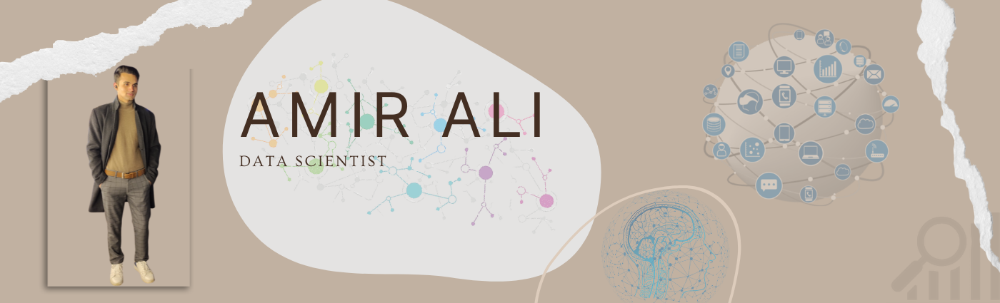

Hi, I am Amir from Pakistan. I did my Bachelor's Degree in Computer Science from the University of Engineering and Technology, Lahore, Pakistan. In August 2020 Granted Ignacy Łukasiewicz Scholarship for Master Study under Polish National Agency for Academic Exchange (NAWA). Currently, I am in Poland and doing  Master's in Data Science at Warsaw University of Technology.

# Hi I'm Amir
📚Data Scientist 🏃‍♂️Athlete ♟Chess Lover  
🎓Warsaw University of Technology  
📍Warsaw, Poland

## My Stats
 

 
 ## Academic Profile!
 

## Social Information
          

<!--
**AmirAli5/AmirAli5** is a ✨ _special_ ✨ repository because its `README.md` (this file) appears on your GitHub profile.

Here are some ideas to get you started:

- 🔭 I’m currently working on ...
- 🌱 I’m currently learning ...
- 👯 I’m looking to collaborate on ...
- 🤔 I’m looking for help with ...
- 💬 Ask me about ...
- 📫 How to reach me: ...
- 😄 Pronouns: ...
- ⚡ Fun fact: ...
-->
